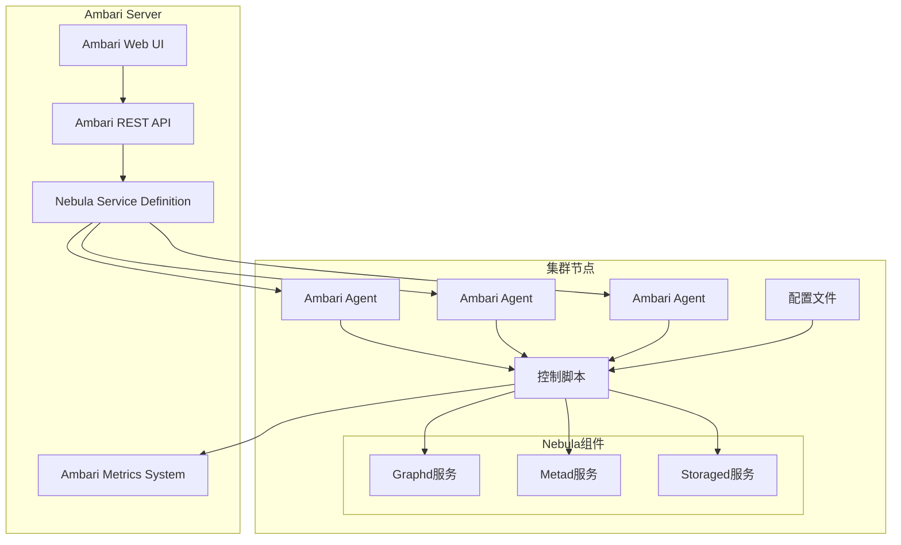
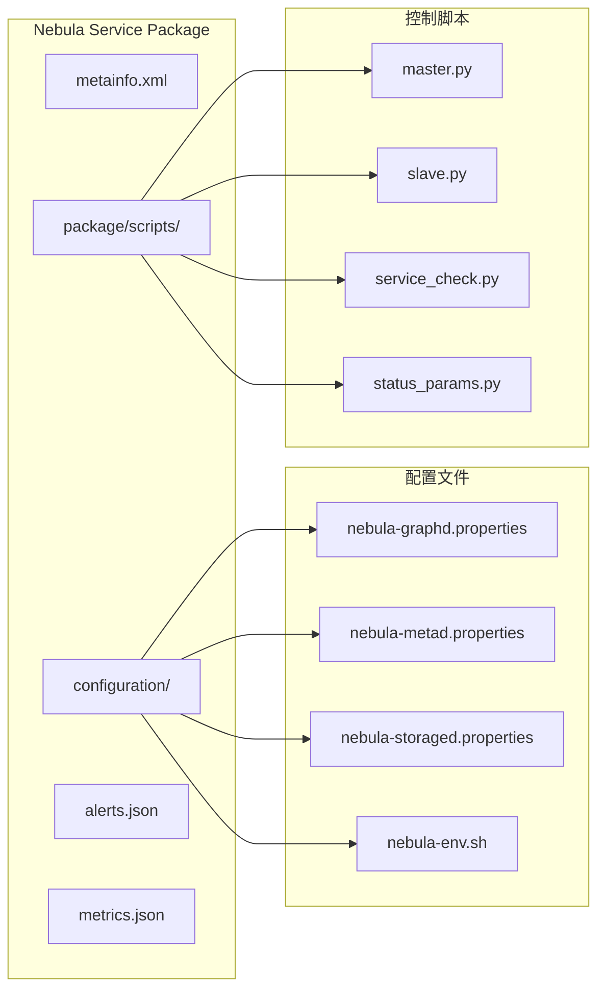
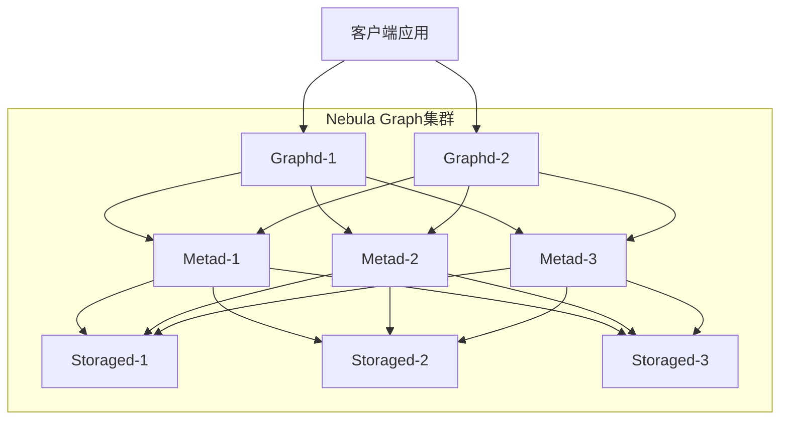
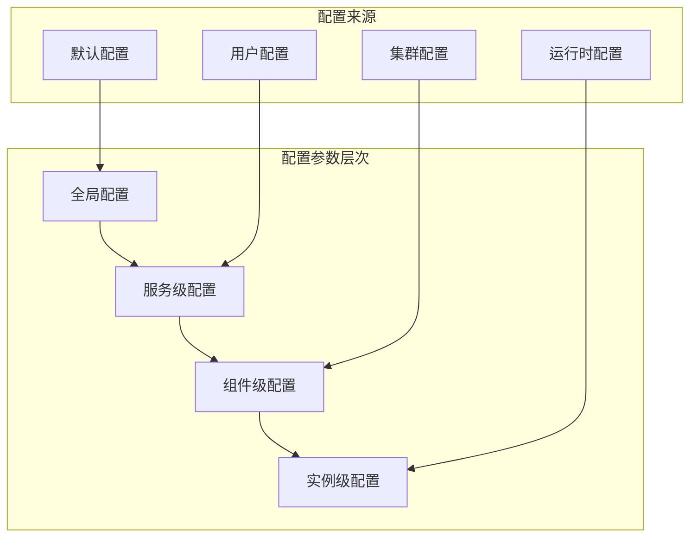
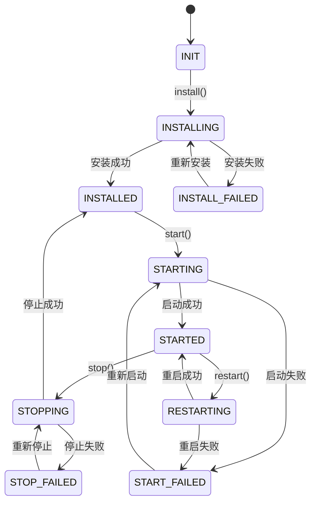
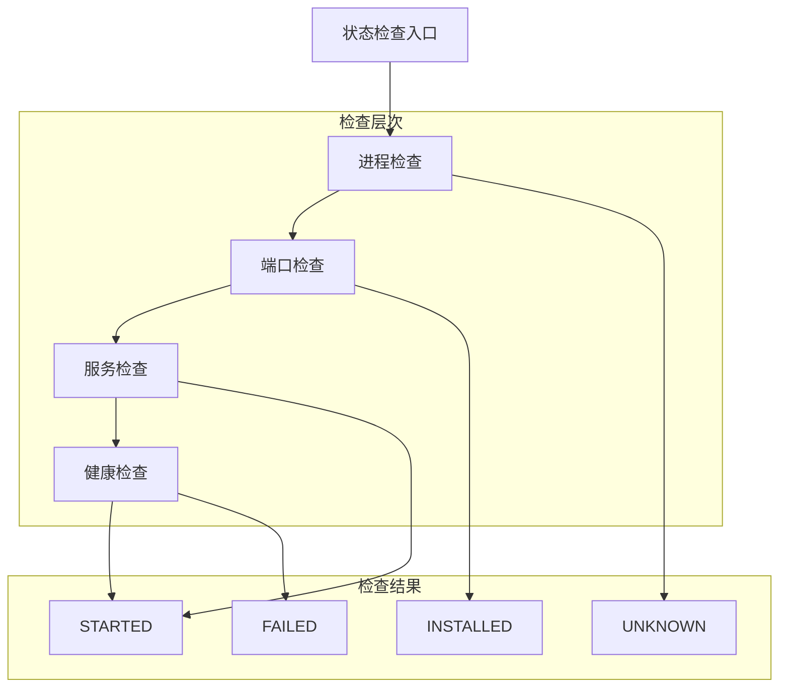
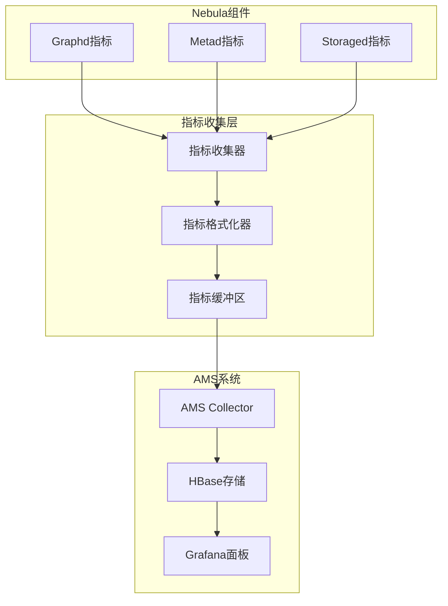
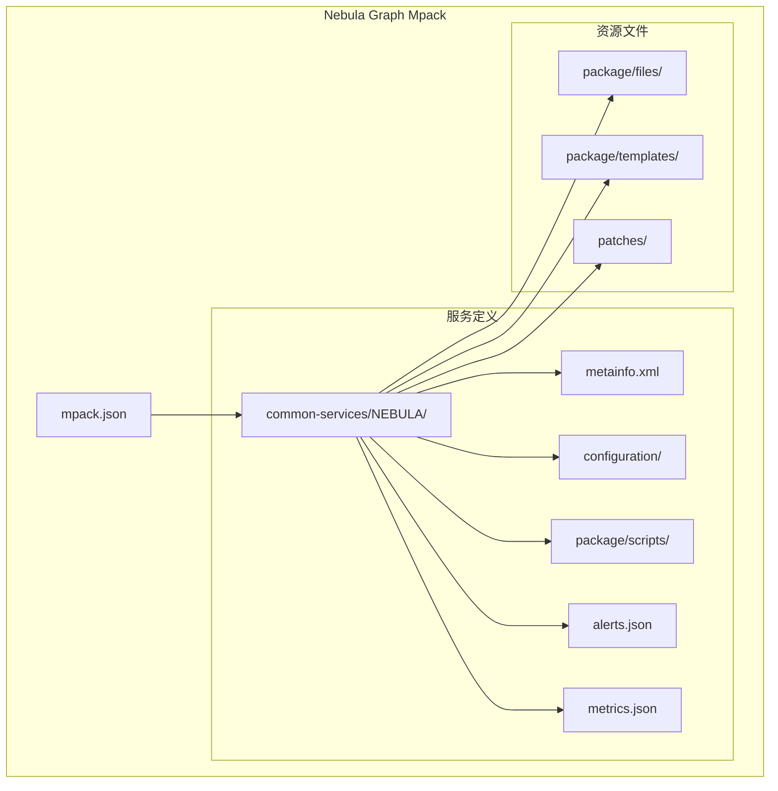
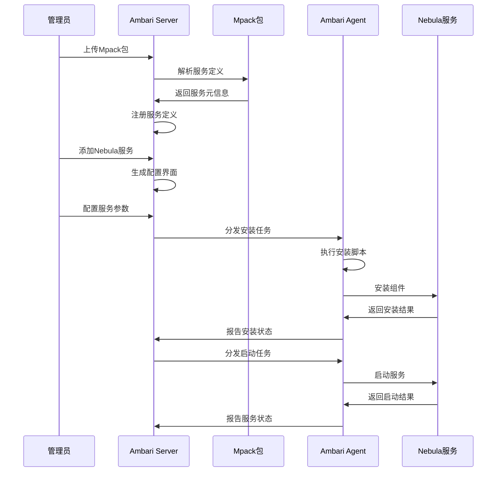

# Ambari Nebula Graph服务扩展设计文档

## 概述

本设计文档定义了通过Ambari原生框架扩展实现Nebula Graph集群监控集成的技术方案。该方案采用深度集成方式，为Nebula Graph开发自定义的Ambari服务定义，使其能够像HDFS等原生服务一样在Ambari中进行统一管理和监控。

### 项目目标

- 实现Ambari对Nebula Graph集群多台设备的统一监控
- 提供Nebula Graph服务的生命周期管理（安装、启动、停止、状态检查）
- 集成监控指标到Ambari Metrics System（AMS）
- 通过Ambari Web界面提供友好的配置和管理体验

### 核心价值

- **统一管理**：将Nebula Graph纳入现有Ambari集群管理体系
- **可视化监控**：通过Ambari界面直观显示服务健康状态和性能指标
- **自动化运维**：利用Ambari的自动化部署和配置管理能力
- **企业级集成**：符合企业级大数据平台的统一运维标准

## 架构设计

### 整体架构

### 服务定义架构

## 服务组件定义

### Nebula Graph组件映射

| Nebula组件 | Ambari组件类型 | 部署策略 | 主要职责 |
|------------|----------------|----------|----------|
| Graphd | MASTER | 多实例部署 | 查询引擎，处理客户端请求 |
| Metad | MASTER | 3-5个奇数实例 | 元数据管理，集群协调 |
| Storaged | SLAVE | 所有数据节点 | 数据存储，图数据管理 |

### 组件依赖关系

## 配置管理架构

### 配置文件结构

| 配置文件 | 作用范围 | 配置内容 |
|----------|----------|----------|
| nebula-graphd.properties | Graphd组件 | 端口配置、内存设置、日志级别、连接池参数 |
| nebula-metad.properties | Metad组件 | 集群配置、数据目录、心跳间隔、选举参数 |
| nebula-storaged.properties | Storaged组件 | 存储路径、缓存配置、压缩设置、备份参数 |
| nebula-env.sh | 全局环境 | Java路径、内存分配、GC参数、系统变量 |

### 配置参数分类

### 重要配置参数

#### Graphd配置参数

| 参数名称 | 默认值 | 描述 | 可调范围 |
|----------|--------|------|----------|
| port | 9669 | GraphQL查询端口 | 1024-65535 |
| ws_http_port | 19669 | HTTP服务端口 | 1024-65535 |
| ws_h2_port | 19670 | HTTP/2服务端口 | 1024-65535 |
| num_netio_threads | 4 | 网络IO线程数 | 1-CPU核数 |
| num_accept_threads | 1 | 连接接受线程数 | 1-16 |
| num_worker_threads | 4 | 工作线程数 | 1-CPU核数 |

#### Metad配置参数

| 参数名称 | 默认值 | 描述 | 可调范围 |
|----------|--------|------|----------|
| port | 9559 | 元数据服务端口 | 1024-65535 |
| ws_http_port | 19559 | HTTP管理端口 | 1024-65535 |
| ws_h2_port | 19560 | HTTP/2管理端口 | 1024-65535 |
| data_path | /usr/local/nebula/data/meta | 元数据存储路径 | 有效目录路径 |
| heartbeat_interval_secs | 10 | 心跳间隔（秒） | 1-300 |

#### Storaged配置参数

| 参数名称 | 默认值 | 描述 | 可调范围 |
|----------|--------|------|----------|
| port | 9779 | 存储服务端口 | 1024-65535 |
| ws_http_port | 19779 | HTTP管理端口 | 1024-65535 |
| ws_h2_port | 19780 | HTTP/2管理端口 | 1024-65535 |
| data_path | /usr/local/nebula/data/storage | 数据存储路径 | 有效目录路径 |
| rocksdb_column_family_options | {} | RocksDB列族选项 | JSON格式 |

## 生命周期管理架构

### 服务生命周期状态

### 控制脚本架构

#### 主控制脚本职责

| 脚本方法 | 功能描述 | 执行条件 | 返回状态 |
|----------|----------|----------|----------|
| install() | 安装Nebula组件 | 组件未安装 | SUCCESS/FAILED |
| configure() | 应用配置更改 | 配置变更时 | SUCCESS/FAILED |
| start() | 启动服务进程 | 服务已安装且未运行 | SUCCESS/FAILED |
| stop() | 停止服务进程 | 服务正在运行 | SUCCESS/FAILED |
| status() | 检查服务状态 | 定期调用 | STARTED/INSTALLED/UNKNOWN |
| restart() | 重启服务 | 服务正在运行 | SUCCESS/FAILED |

#### 状态检查机制

### 服务检查策略

#### Graphd服务检查

| 检查项 | 检查方法 | 成功条件 | 失败处理 |
|--------|----------|----------|----------|
| 进程存在 | 检查PID文件 | PID文件存在且进程运行 | 返回INSTALLED状态 |
| 端口监听 | 检查TCP端口 | 9669端口可连接 | 返回进程异常 |
| 服务响应 | 发送简单查询 | 查询正常返回 | 记录响应异常 |
| 连接池状态 | 检查连接数 | 连接池正常 | 记录连接异常 |

#### Metad服务检查

| 检查项 | 检查方法 | 成功条件 | 失败处理 |
|--------|----------|----------|----------|
| 进程存在 | 检查PID文件 | PID文件存在且进程运行 | 返回INSTALLED状态 |
| 端口监听 | 检查TCP端口 | 9559端口可连接 | 返回进程异常 |
| 集群状态 | 查询集群信息 | 集群状态正常 | 记录集群异常 |
| Leader选举 | 检查Leader状态 | Leader选举正常 | 记录选举异常 |

#### Storaged服务检查

| 检查项 | 检查方法 | 成功条件 | 失败处理 |
|--------|----------|----------|----------|
| 进程存在 | 检查PID文件 | PID文件存在且进程运行 | 返回INSTALLED状态 |
| 端口监听 | 检查TCP端口 | 9779端口可连接 | 返回进程异常 |
| 存储状态 | 检查数据目录 | 数据目录可访问 | 记录存储异常 |
| 数据同步 | 检查副本状态 | 数据同步正常 | 记录同步异常 |

## 监控指标集成

### Ambari Metrics System集成架构

### 核心监控指标

#### Graphd监控指标

| 指标类别 | 指标名称 | 指标描述 | 采集频率 | 告警阈值 |
|----------|----------|----------|----------|----------|
| 连接指标 | num_active_sessions | 活跃会话数 | 30秒 | >1000 |
| 性能指标 | query_latency_us | 查询延迟(微秒) | 30秒 | >100000 |
| 性能指标 | qps | 每秒查询数 | 30秒 | <100 |
| 资源指标 | memory_usage_bytes | 内存使用量 | 60秒 | >80% |
| 资源指标 | cpu_usage_percent | CPU使用率 | 60秒 | >80% |

#### Metad监控指标

| 指标类别 | 指标名称 | 指标描述 | 采集频率 | 告警阈值 |
|----------|----------|----------|----------|----------|
| 集群指标 | num_spaces | Space数量 | 300秒 | 无 |
| 集群指标 | num_tags | Tag数量 | 300秒 | 无 |
| 集群指标 | num_edges | Edge数量 | 300秒 | 无 |
| 性能指标 | heartbeat_latency_us | 心跳延迟(微秒) | 30秒 | >50000 |
| 可用性指标 | is_leader | 是否为Leader | 30秒 | false |

#### Storaged监控指标

| 指标类别 | 指标名称 | 指标描述 | 采集频率 | 告警阈值 |
|----------|----------|----------|----------|----------|
| 存储指标 | disk_usage_bytes | 磁盘使用量 | 60秒 | >85% |
| 存储指标 | num_vertices | 顶点数量 | 300秒 | 无 |
| 存储指标 | num_edges | 边数量 | 300秒 | 无 |
| 性能指标 | get_latency_us | Get操作延迟 | 30秒 | >10000 |
| 性能指标 | put_latency_us | Put操作延迟 | 30秒 | >10000 |

### 告警规则定义

#### 服务级别告警

| 告警类型 | 触发条件 | 告警级别 | 通知方式 | 恢复条件 |
|----------|----------|----------|----------|----------|
| 服务不可用 | 服务状态检查失败 | CRITICAL | 邮件+短信 | 服务恢复正常 |
| 性能异常 | 查询延迟>100ms持续5分钟 | WARNING | 邮件 | 延迟恢复正常 |
| 资源告警 | CPU/内存使用率>80%持续10分钟 | WARNING | 邮件 | 使用率降至70%以下 |
| 存储告警 | 磁盘使用率>85% | WARNING | 邮件 | 磁盘使用率降至80%以下 |

#### 集群级别告警

| 告警类型 | 触发条件 | 告警级别 | 通知方式 | 恢复条件 |
|----------|----------|----------|----------|----------|
| 集群不可用 | 超过半数Metad节点不可用 | CRITICAL | 邮件+短信+钉钉 | 集群恢复正常 |
| 数据不一致 | 存储副本同步异常 | CRITICAL | 邮件+短信 | 数据同步正常 |
| 连接异常 | 组件间连接失败 | WARNING | 邮件 | 连接恢复正常 |

## 部署和打包架构

### Mpack包结构

### 安装部署流程

### 版本兼容性

#### Ambari版本支持

| Ambari版本 | 支持状态 | 兼容性说明 | 推荐版本 |
|------------|----------|------------|----------|
| 2.6.x | 支持 | 基础功能完整支持 | 2.6.2+ |
| 2.7.x | 推荐 | 最佳兼容性和性能 | 2.7.5+ |
| 2.8.x | 支持 | 新特性支持良好 | 2.8.0+ |

#### Nebula Graph版本支持

| Nebula版本 | 支持状态 | 配置差异 | 特殊说明 |
|------------|----------|----------|----------|
| 2.6.x | 支持 | 配置项较少 | 基础监控支持 |
| 3.0.x | 推荐 | 配置项丰富 | 完整功能支持 |
| 3.1.x+ | 支持 | 新增配置项 | 最新特性支持 |

## 测试策略

### 功能测试

#### 安装测试

| 测试场景 | 测试步骤 | 期望结果 | 验证方法 |
|----------|----------|----------|----------|
| 全新安装 | 在空集群上安装Nebula服务 | 所有组件成功安装 | 检查进程和文件 |
| 升级安装 | 从旧版本升级到新版本 | 配置保留，服务正常 | 验证配置和数据 |
| 回滚安装 | 升级失败后回滚 | 恢复到原始状态 | 检查版本和配置 |

#### 配置测试

| 测试场景 | 测试步骤 | 期望结果 | 验证方法 |
|----------|----------|----------|----------|
| 参数修改 | 通过Ambari界面修改配置 | 配置正确应用 | 检查配置文件 |
| 配置验证 | 输入无效配置参数 | 显示验证错误 | 验证错误信息 |
| 配置分发 | 配置更改分发到所有节点 | 所有节点配置一致 | 对比配置文件 |

#### 生命周期测试

| 测试场景 | 测试步骤 | 期望结果 | 验证方法 |
|----------|----------|----------|----------|
| 服务启动 | 通过Ambari启动服务 | 所有组件正常启动 | 检查进程状态 |
| 服务停止 | 通过Ambari停止服务 | 所有组件正常停止 | 验证进程退出 |
| 服务重启 | 通过Ambari重启服务 | 服务正常重启 | 检查重启时间 |

### 性能测试

#### 监控性能测试

| 测试指标 | 测试方法 | 性能要求 | 测试工具 |
|----------|----------|----------|----------|
| 指标采集延迟 | 测量指标从产生到显示的时间 | <30秒 | 自定义脚本 |
| 监控开销 | 测量监控对业务性能的影响 | <5% | 性能分析工具 |
| 大规模集群 | 在100+节点集群中测试 | 正常运行 | 集群压测 |

#### 稳定性测试

| 测试场景 | 测试方法 | 测试时长 | 成功标准 |
|----------|----------|----------|----------|
| 长期运行 | 持续运行监控系统 | 7天 | 无内存泄漏，服务稳定 |
| 故障恢复 | 模拟节点故障和网络异常 | 24小时 | 自动恢复，数据完整 |
| 高负载 | 高频率配置变更和重启 | 4小时 | 系统响应正常 |

### 集成测试

#### Ambari集成测试

| 测试项目 | 测试内容 | 验证点 | 测试方法 |
|----------|----------|--------|----------|
| UI集成 | Ambari界面显示Nebula服务 | 界面元素完整 | 手工测试 |
| API集成 | 通过REST API管理服务 | API响应正确 | 自动化脚本 |
| 告警集成 | 告警正确触发和通知 | 告警及时准确 | 故障注入 |

#### 监控系统集成测试

| 测试项目 | 测试内容 | 验证点 | 测试方法 |
|----------|----------|--------|----------|
| AMS集成 | 指标正确发送到AMS | 指标数据完整 | 数据验证 |
| Grafana集成 | 仪表板正确显示指标 | 图表数据准确 | 视觉验证 |
| 告警集成 | 告警规则正确执行 | 告警逻辑正确 | 边界测试 |